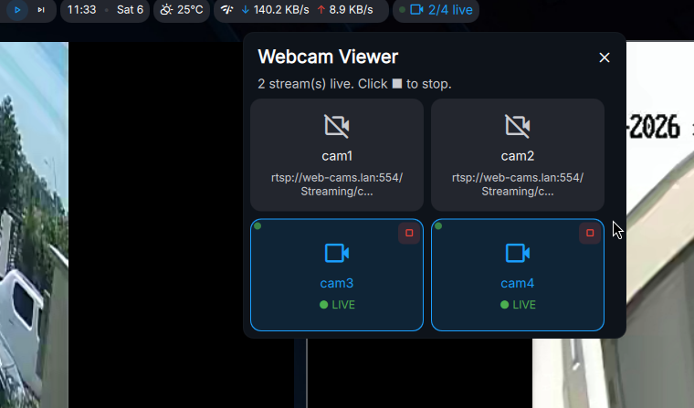
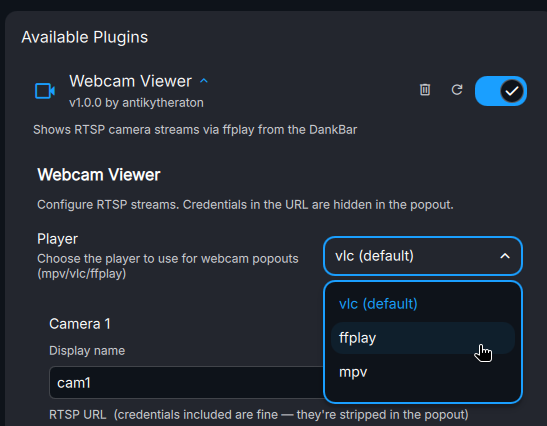

# DankWebcamViewer

A [DankMaterialShell](https://github.com/AvengeMedia/DankMaterialShell) plugin that shows a webcam feed in a window. It can be used to monitor a webcam feed while working on other tasks.

## Installation

### Nix (flake)

### Manual

Copy the plugin folder to `~/.config/DankMaterialShell/plugins/DankWebcamViewer/` and restart DankMaterialShell.

## Requirements

- You need any of the following tools to capture webcam feed:
  - `vlc`
  - `ffmpeg/ffplay`
  - `mpv`

By default, the plugin will try to use `vlc` to capture the webcam feed. If `vlc` is not available. You can select the player from the plugin settings

## License

GNU AGPLv3

